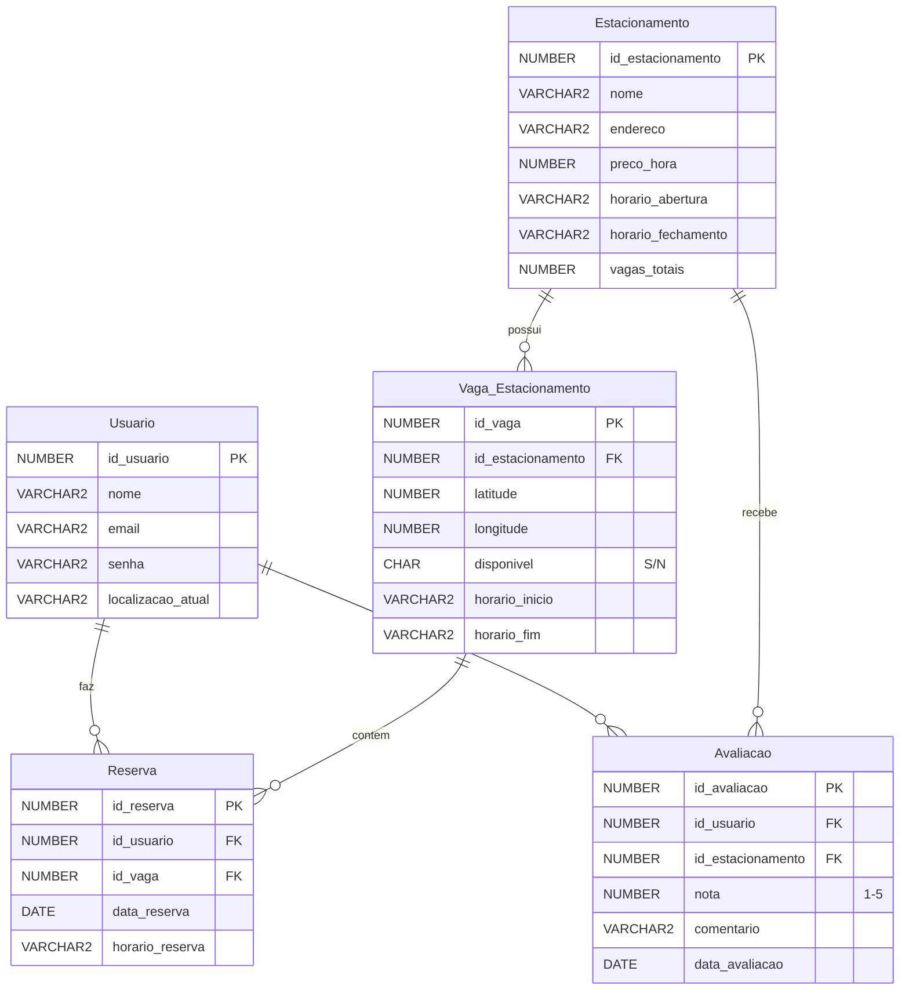

# 🚗 Sistema de Indicação de Estacionamento via Waze

## 📋 Descrição do Projeto

Este projeto de Banco de Dados, desenvolvido para a disciplina de Banco de Dados, consiste na modelagem e implementação de um sistema de **Indicação de Estacionamento via Waze**.

O objetivo principal é otimizar a mobilidade urbana, ajudando motoristas a encontrar vagas de estacionamento de forma rápida e eficiente. O sistema utiliza geolocalização para permitir que os usuários visualizem estacionamentos próximos, consultem preços, verifiquem a disponibilidade de vagas, realizem reservas e avaliem os estabelecimentos.

---

## 👥 Membros da Equipe

| Nome | RA |
| :--- | :--- |
| Kauan Sarzi da Rocha | 10427235 |
| Gabriel Freitas | 10435826 |
| Guilherme Shinohara | 10439165 |

---

## 🛠️ Tecnologias Utilizadas

*   **SGBD:** Oracle (O script SQL foi testado no Oracle Live SQL)
*   **Linguagem:** SQL
*   **Modelagem:** Modelo Entidade-Relacionamento (MER) e Modelo Relacional

---

## 📐 Modelagem do Banco de Dados

O banco de dados é composto por 5 entidades principais, refletindo as informações essenciais para o funcionamento do sistema:

### 1. Entidades e Atributos

| Entidade | Chave Primária (PK) | Atributos Principais |
| :--- | :--- | :--- |
| **Usuario** | `id_usuario` | `nome`, `email`, `senha`, `localizacao_atual` |
| **Estacionamento** | `id_estacionamento` | `nome`, `endereco`, `preco_hora`, `horario_abertura`, `horario_fechamento`, `vagas_totais` |
| **Vaga_Estacionamento** | `id_vaga` | `latitude`, `longitude`, `disponivel`, `horario_inicio`, `horario_fim`, `id_estacionamento` (FK) |
| **Reserva** | `id_reserva` | `data_reserva`, `horario_reserva`, `id_usuario` (FK), `id_vaga` (FK) |
| **Avaliacao** | `id_avaliacao` | `nota` (1 a 5), `comentario`, `data_avaliacao`, `id_usuario` (FK), `id_estacionamento` (FK) |

### 2. Diagrama do Modelo Relacional

O diagrama abaixo ilustra a estrutura das tabelas e os relacionamentos definidos:



---

## 💾 Script SQL

O arquivo `item3eitem5.txt` contém o script completo para a criação do banco de dados, inserção de dados de exemplo e as consultas solicitadas.

### 1. Estrutura do Script

O script segue a ordem recomendada para execução:

1.  **`DROP TABLE`**: Comandos para limpar o ambiente e garantir uma execução limpa.
2.  **`CREATE TABLE`**: Definição das 5 tabelas com suas chaves primárias, estrangeiras e restrições (`NOT NULL`, `UNIQUE`, `CHECK`).
3.  **`INSERT INTO`**: Inserção de dados fictícios para popular as tabelas.
4.  **`SELECT`**: Quatro consultas SQL complexas para demonstrar a funcionalidade do banco de dados.

### 2. Consultas SQL

As consultas foram elaboradas para atender aos requisitos do projeto, demonstrando a capacidade de extrair informações relevantes do sistema:

| Requisito | Descrição da Consulta | SQL (Exemplo) |
| :--- | :--- | :--- |
| **5.1** (2 Tabelas, INNER JOIN, sem GROUP BY) | Lista o nome do usuário e os detalhes de suas reservas. | `SELECT u.nome, r.data_reserva, r.horario_reserva FROM Usuario u INNER JOIN Reserva r ...` |
| **5.2** (2 Tabelas, INNER JOIN, com GROUP BY) | Conta o total de reservas por estacionamento. | `SELECT e.nome, COUNT(r.id_reserva) FROM Estacionamento e INNER JOIN Vaga_Estacionamento v ... GROUP BY e.nome` |
| **5.3** (2 Tabelas, LEFT/RIGHT JOIN) | Calcula a nota média de avaliação para cada estacionamento (incluindo aqueles sem avaliação). | `SELECT e.nome, NVL(AVG(a.nota), 0) FROM Estacionamento e LEFT JOIN Avaliacao a ... GROUP BY e.nome` |
| **5.4** (3+ Tabelas) | Lista o status da reserva, a disponibilidade da vaga e a nota de avaliação associada. | `SELECT u.nome, e.nome, v.disponivel, r.data_reserva, a.nota FROM Reserva r INNER JOIN Usuario u ... LEFT JOIN Avaliacao a ...` |

---

## 🚀 Como Utilizar

Para recriar o ambiente do projeto, siga os passos:

1.  **Instalação do SGBD:** Certifique-se de ter acesso a um ambiente Oracle (local ou via Oracle Live SQL).
2.  **Execução do Script:** Execute o conteúdo do arquivo `item3eitem5.txt` na ordem em que está.
    *   As instruções `DROP TABLE` limparão quaisquer tabelas existentes com os mesmos nomes.
    *   As instruções `CREATE TABLE` criarão o esquema.
    *   As instruções `INSERT INTO` popularão o banco de dados com dados de teste.
    *   As instruções `SELECT` podem ser executadas para verificar os resultados das consultas.

```sql
-- Exemplo de execução (conteúdo do item3eitem5.txt)
-- DROP TABLE ...
-- CREATE TABLE ...
-- INSERT INTO ...
-- SELECT ...
```
